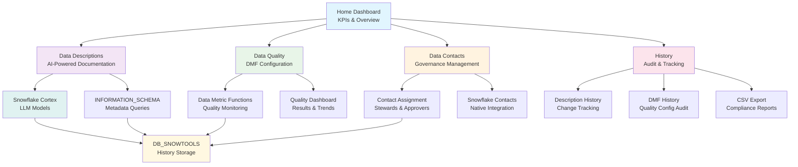

# Snowflake Data Quality & Documentation Platform

<div align="center">

**A comprehensive Streamlit application for enhancing data governance in Snowflake through AI-powered documentation, automated data quality monitoring, and contact management.**

[](https://streamlit.io/)
[](https://snowflake.com/)
[](https://python.org/)

*Optimized for **Streamlit in Snowflake (SiS)** with full local development support*

</div>

---

## Demo & Overview

[](https://youtu.be/OdKl4yq7ikY)

*Click to watch the full demo and feature walkthrough*

---

## Table of Contents

- [Purpose & Value Proposition](#purpose--value-proposition)
- [Application Flow](#application-flow)
- [Core Features](#core-features)
- [Stored Procedure: Code-First Documentation](#stored-procedure-code-first-documentation)
- [Quick Start](#quick-start)
- [Required Permissions](#required-permissions)
- [User Guide](#user-guide)
- [Documentation & Resources](#documentation--resources)
- [Technical Architecture](#technical-architecture)
- [Troubleshooting](#troubleshooting)
- [Best Practices](#best-practices)

---

## Purpose & Value Proposition

This application transforms your Snowflake environment into a **well-documented, high-quality data platform** by providing:

- **AI-Powered Documentation**: Leverage Snowflake Cortex LLMs to automatically generate intelligent table and column descriptions
- **Data Quality Monitoring**: Comprehensive Data Metric Functions (DMF) setup and monitoring dashboard
- **Data Governance**: Complete contact management system for data stewards, technical support, and access approvers
- **Executive Insights**: Real-time KPIs and governance metrics for data leadership
- **Audit & Compliance**: Complete historical tracking of all changes and improvements
- **Enterprise-Ready**: Native Snowflake integration with no external dependencies

### Target Audience

- **Data Engineers**: Streamline data quality monitoring and documentation workflows
- **Data Stewards**: Maintain comprehensive data governance and contact management
- **Analytics Teams**: Ensure high-quality, well-documented data for analysis
- **Data Leaders**: Monitor governance KPIs and compliance metrics
- **Platform Teams**: Deploy enterprise-grade data governance tools


---

## Application Flow

The following diagram illustrates how the different components of the application work together:



---

## Core Features

### AI-Powered Data Documentation

Transform your undocumented tables and columns into comprehensive, intelligent documentation:

- **Multi-Model Support**: Choose from Snowflake Cortex models:
  - `claude-4-sonnet` (Premium reasoning)
  - `mistral-large2` (Balanced performance)
  - `llama3-70b` (Open source)
  - `snowflake-arctic` (Snowflake optimized)
  - `snowflake-llama-3.1-405b` (Latest large model)

- **Smart Context Analysis**: Analyzes table structure, column types, and sample data
- **Bulk Operations**: Generate descriptions for multiple tables and columns simultaneously
- **View Support**: Advanced DDL parsing and recreation for complex views
- **Optimized Output**: 150 chars for tables, 100 chars for columns
- **Real-time Preview**: Review generated descriptions before applying

### Advanced Data Quality Monitoring

Comprehensive Data Metric Functions (DMF) setup and monitoring:

#### Supported Metrics

| **Level** | **Metric Types** | **Use Cases** |
|-----------|------------------|---------------|
| **Table** | `ROW_COUNT`, `FRESHNESS` | Monitor data volume and recency |
| **Column** | `NULL_COUNT`, `NULL_PERCENT` | Data completeness validation |
| **Column** | `DUPLICATE_COUNT`, `UNIQUE_COUNT` | Data uniqueness monitoring |
| **Column** | `ACCEPTED_VALUES` | Domain validation |
| **Column** | `AVG`, `MAX`, `MIN`, `STDDEV` | Statistical monitoring |

#### Configuration Features

- **Flexible Scheduling**: Periodic (minutes/hours), daily, or trigger-on-changes
- **Bulk Configuration**: Apply metrics to all columns or configure individually
- **SQL Generation**: Download ready-to-execute SQL scripts
- **Results Dashboard**: Comprehensive monitoring with filters and KPIs
- **Historical Analysis**: Track quality trends over time

### Data Governance & Contacts

Complete contact management system for data governance:

- **Contact Types**:
  - **Data Steward**: Primary data owner and quality manager
  - **Technical Support**: Technical issues and system access
  - **Access Approver**: Data access request approvals

- **Current Assignments**: View existing contacts for any table
- **Pre-populated Forms**: Automatically populate dropdowns with existing assignments
- **SQL Generation**: Generate `ALTER TABLE SET CONTACT` statements
- **Native Integration**: Seamless integration with Snowflake's contact system

### Executive Dashboard & KPIs

Real-time governance metrics for data leadership:

- **Real-time Metrics**:
  - Total Databases, Schemas, Tables & Views
  - Documentation coverage percentage
  - Active data quality monitors
  - Contact assignments coverage

- **Visual KPI Cards**: Modern, gradient-styled metric displays
- **Manual Refresh**: Force refresh of all KPIs from Snowflake
- **Trend Analysis**: Monitor improvements over time

### Comprehensive History & Audit

Complete audit trail for compliance and governance:

- **Description History**: Track all table, view, and column description changes
- **DMF Configuration History**: Monitor data quality setup changes
- **Contact Assignment History**: Audit trail for governance assignments
- **Export Capabilities**: Download history as CSV for compliance reporting
- **User Attribution**: Track who made what changes when

---

## Stored Procedure: Code-First Documentation

### GENERATE_AI_DESCRIPTIONS Procedure

For users who prefer **code-first approaches** or need to **integrate documentation generation into automated workflows**, we provide a powerful stored procedure that replicates all the functionality of the Data Descriptions tab.

#### Overview

The `GENERATE_AI_DESCRIPTIONS` stored procedure provides the same AI-powered documentation capabilities as the Streamlit app, but in pure SQL/JavaScript for seamless integration into your data pipelines, CI/CD processes, or automated governance workflows.

#### Key Features

- **🔄 Same AI Logic**: Uses identical prompts and models as the Streamlit app
- **📊 Bulk Processing**: Process multiple tables and all their columns in a single call
- **🎯 Flexible Targeting**: Generate table descriptions, column descriptions, or both
- **🤖 Multi-Model Support**: Works with all Snowflake Cortex models
- **⚡ High Performance**: JavaScript-based for optimal string handling and execution
- **🔒 Enterprise Ready**: Handles cross-database queries and complex permissions

#### Installation

The stored procedure is automatically created when you run the setup script, or you can create it manually:

```sql
-- Run the stored procedure creation script
@sql/generate_ai_descriptions.sql
```

#### Usage

```sql
-- Basic syntax
CALL GENERATE_AI_DESCRIPTIONS(
    DATABASE_NAME,    -- Target database
    SCHEMA_NAME,      -- Target schema  
    TABLE_NAMES,      -- Array of table names
    MODEL_NAME,       -- Cortex model (optional, default: 'llama3.1-8b')
    GENERATE_TYPE     -- 'TABLE', 'COLUMN', or 'BOTH' (optional, default: 'TABLE')
);
```

#### Examples

```sql
-- Generate table descriptions only
CALL GENERATE_AI_DESCRIPTIONS(
    'SALES_DB', 
    'ANALYTICS', 
    ['CUSTOMER_ORDERS', 'PRODUCT_CATALOG'], 
    'claude-4-sonnet', 
    'TABLE'
);

-- Generate both table and column descriptions
CALL GENERATE_AI_DESCRIPTIONS(
    'CALL_CENTER', 
    'TRANSCRIPTS', 
    ['CALL_TRANSCRIPTS'], 
    'claude-4-sonnet', 
    'BOTH'
);

-- Generate only column descriptions with different model
CALL GENERATE_AI_DESCRIPTIONS(
    'RETAIL_DEMO', 
    'SALES', 
    ['ECOM_SALES', 'STORE_SALES'], 
    'mistral-large2', 
    'COLUMN'
);
```

#### Parameters

| Parameter | Type | Description | Default |
|-----------|------|-------------|---------|
| `DATABASE_NAME` | STRING | Target database name | Required |
| `SCHEMA_NAME` | STRING | Target schema name | Required |
| `TABLE_NAMES` | ARRAY | Array of table names to process | Required |
| `MODEL_NAME` | STRING | Snowflake Cortex model to use | `'llama3.1-8b'` |
| `GENERATE_TYPE` | STRING | What to generate: `'TABLE'`, `'COLUMN'`, or `'BOTH'` | `'TABLE'` |

#### Supported Models

All Snowflake Cortex models are supported:
- `claude-4-sonnet` (Premium reasoning)
- `mistral-large2` (Balanced performance) 
- `llama3.1-8b` (Fast and efficient)
- `llama3.1-70b` (Enhanced reasoning)
- `snowflake-arctic` (Snowflake optimized)

#### Integration Use Cases

**CI/CD Pipelines**
```sql
-- Automatically document new tables after deployment
CALL GENERATE_AI_DESCRIPTIONS('PROD_DB', 'NEW_SCHEMA', ['TABLE1', 'TABLE2'], 'claude-4-sonnet', 'BOTH');
```

**Data Pipeline Automation**
```sql
-- Document tables as part of your dbt post-hooks or data pipeline
CALL GENERATE_AI_DESCRIPTIONS('{{ var("database") }}', '{{ var("schema") }}', ['{{ this.name }}'], 'llama3.1-8b', 'BOTH');
```

**Scheduled Documentation**
```sql
-- Create tasks to periodically update documentation
CREATE TASK WEEKLY_DOCUMENTATION
WAREHOUSE = COMPUTE_WH
SCHEDULE = 'USING CRON 0 9 * * 1 UTC'  -- Every Monday at 9 AM
AS
CALL GENERATE_AI_DESCRIPTIONS('ANALYTICS_DB', 'MARTS', ['DIM_CUSTOMER', 'FACT_ORDERS'], 'claude-4-sonnet', 'BOTH');
```

#### Return Values

The procedure returns a detailed summary:
```
AI Description Generation Complete! 
Processed 2 table(s). 
Generated 2 table description(s) and 15 column description(s). 
Model used: claude-4-sonnet. Generation type: BOTH.
```

#### Technical Implementation

- **Language**: JavaScript for optimal string handling and performance
- **Error Handling**: Continues processing even if individual tables/columns fail
- **Cross-Database**: Handles queries across different databases using fully qualified INFORMATION_SCHEMA paths
- **Parameter Binding**: Uses secure parameter binding to prevent SQL injection
- **Atomic Operations**: Each table/column is processed independently for reliability

#### Comparison: Streamlit App vs Stored Procedure

| Feature | Streamlit App | Stored Procedure |
|---------|---------------|------------------|
| **User Interface** | ✅ Visual, interactive | ❌ Code-only |
| **Bulk Operations** | ✅ Multi-select UI | ✅ Array parameter |
| **Preview & Review** | ✅ Before applying | ❌ Direct application |
| **Integration** | ❌ Manual process | ✅ Automation-ready |
| **Filtering** | ✅ Show undocumented only | ❌ Processes all specified |
| **Real-time Feedback** | ✅ Progress indicators | ✅ Summary return message |
| **Error Handling** | ✅ User-friendly messages | ✅ Continues on errors |
| **Model Testing** | ✅ Test model availability | ❌ Assumes model works |

#### Best Practices

1. **Start Small**: Test with a single table before processing large batches
2. **Choose Appropriate Models**: Use `claude-4-sonnet` for complex tables, `llama3.1-8b` for simple ones
3. **Monitor Costs**: Track Cortex usage, especially with premium models
4. **Error Monitoring**: Check return messages for processing summaries
5. **Incremental Processing**: Process tables in batches rather than all at once
6. **Database Context**: Ensure the procedure has access to target databases

---

## Quick Start

### Option 1: Streamlit in Snowflake (Recommended)

1. Copy the SQL from the [Setup_Script.sql](Setup_Script.sql) and run in your Snowflake Environment. 

### Option 2: Local Development

```bash
# Clone the repository
git clone <repository-url>
cd db-snowdq

# Install dependencies
pip install -r requirements.txt

# Configure Snowflake connection - This is a REQUIREMENT
# Create ~/.snowflake/connections.toml with your credentials

# Run the application
streamlit run app.py
```

### Automatic Setup

The app automatically creates required database objects on first run:
- `DB_SNOWTOOLS` database
- `DATA_DESCRIPTION_HISTORY` table
- `DATA_QUALITY_RESULTS` table

---

## Required Permissions

### The initial version of this app, if installed from the Setup_Script.sql, runs as AccountAdmin.   

### Core System Access

```sql
-- Metadata and system access
GRANT IMPORTED PRIVILEGES ON DATABASE SNOWFLAKE TO ROLE your_role;
GRANT DATABASE ROLE SNOWFLAKE.OBJECT_VIEWER TO ROLE your_role;

-- Cortex LLM access for AI descriptions
GRANT DATABASE ROLE SNOWFLAKE.CORTEX_USER TO ROLE your_role;

-- Data quality monitoring
GRANT DATABASE ROLE SNOWFLAKE.DATA_METRIC_USER TO ROLE your_role;
GRANT APPLICATION ROLE SNOWFLAKE.DATA_QUALITY_MONITORING_LOOKUP TO ROLE your_role;
```

### Data Access (Customize for Your Databases)

```sql
-- Grant access to your data databases
GRANT USAGE ON DATABASE your_database TO ROLE your_role;
GRANT USAGE ON ALL SCHEMAS IN DATABASE your_database TO ROLE your_role;
GRANT SELECT ON ALL TABLES IN DATABASE your_database TO ROLE your_role;
GRANT SELECT ON ALL VIEWS IN DATABASE your_database TO ROLE your_role;

-- For description updates
GRANT MODIFY ON ALL TABLES IN DATABASE your_database TO ROLE your_role;
GRANT MODIFY ON ALL VIEWS IN DATABASE your_database TO ROLE your_role;

-- For contact management
GRANT REFERENCES ON ALL TABLES IN DATABASE your_database TO ROLE your_role;
```

### DMF Setup (For Data Quality)

```sql
-- For setting up Data Metric Functions
GRANT OWNERSHIP ON TABLE your_database.your_schema.your_table TO ROLE your_role;
-- OR
GRANT ALL PRIVILEGES ON TABLE your_database.your_schema.your_table TO ROLE your_role;
```

---

## User Guide

### Home Dashboard
- **KPI Overview**: View real-time governance metrics
- **Quick Actions**: Navigate directly to key features
- **System Information**: Connection details and platform overview
- **Setup Status**: Verify database objects are configured

### Data Descriptions
1. **Select Database/Schema**: Choose your target objects
2. **Filter Objects**: Show only undocumented items
3. **Choose LLM Model**: Select from available Cortex models
4. **Select Objects**: Use checkboxes to choose tables/views
5. **Generate Descriptions**: Choose table, column, or both
6. **Review Results**: View generated descriptions in collapsible sections
7. **Refresh Data**: Use the refresh button to see applied changes

### Data Quality
1. **Select Target Table**: Choose database, schema, and table
2. **Set Schedule**: Configure monitoring frequency
3. **Choose DMFs**: Select table-level and column-level metrics
4. **Generate SQL**: Download or apply DMF configuration
5. **Monitor Results**: View quality check results and trends

### Data Contacts
1. **Select Table**: Choose your target table
2. **View Current Contacts**: See existing assignments
3. **Update Assignments**: Set steward, support, and approver contacts
4. **Apply Changes**: Execute generated SQL or download for later

### History
- **Description History**: Track all documentation changes
- **Quality History**: Comprehensive DMF monitoring dashboard
- **Export Options**: Download history data for reporting

---

## Documentation & Resources

### Official Snowflake Documentation

- **Data Metric Functions (DMF)**: [Snowflake DMF Documentation](https://docs.snowflake.com/en/user-guide/data-quality-intro)
- **Snowflake Cortex**: [Cortex LLM Functions](https://docs.snowflake.com/en/user-guide/snowflake-cortex/llm-functions)
- **Data Governance**: [Contact Management](https://docs.snowflake.com/en/sql-reference/sql/alter-table#contact-management)
- **Streamlit in Snowflake**: [SiS Documentation](https://docs.snowflake.com/en/developer-guide/streamlit/about-streamlit)
- **Access Control**: [RBAC Guide](https://docs.snowflake.com/en/user-guide/security-access-control-overview)

### Technical References

- **INFORMATION_SCHEMA**: [Metadata Views](https://docs.snowflake.com/en/sql-reference/info-schema)
- **Data Quality Monitoring**: [Quality Results](https://docs.snowflake.com/en/user-guide/data-quality-monitoring)
- **Best Practices**: [Data Governance](https://docs.snowflake.com/en/user-guide/data-governance-overview)

---

## Technical Architecture

### SiS Compatibility Features

- **Primary Queries**: Uses `INFORMATION_SCHEMA` views for consistent results
- **Fallback System**: Automatic fallback to `SHOW` commands when needed
- **Permission Handling**: Graceful degradation with helpful error messages
- **Debug Mode**: Detailed logging for troubleshooting permission issues

### Performance Optimizations

- **Intelligent Caching**: `@st.cache_data` with TTL for optimal performance
- **Batch Operations**: Efficient bulk processing for large datasets
- **Minimal Warehouse Usage**: Optimized for small warehouse compatibility
- **Memory Management**: Designed for SiS 32MB data transfer limits

### Security & Compliance

- **Role-Based Access Control**: Follows Snowflake RBAC best practices
- **Complete Audit Trail**: All changes tracked with user attribution
- **Data Privacy**: No external data transfers (runs entirely in Snowflake)
- **Permission Isolation**: Clear separation between app and user data access

---

## Troubleshooting

### Common SiS Issues

**Tables/Columns Not Displaying**
- **Fixed**: Now uses `INFORMATION_SCHEMA` queries for better compatibility
- Check app owner has proper database access permissions
- Verify `INFORMATION_SCHEMA` access is available

**Permission Errors**
- Ensure app owner role has required system privileges
- Grant `USAGE` on target databases and schemas
- Verify Cortex and DMF roles are properly assigned

**DMF Setup Failures**
- DMFs require table ownership or full privileges
- Run generated SQL with appropriate role
- Check that schedules are properly configured

### Performance Issues

- Use smaller warehouse for better cost efficiency
- Enable caching by avoiding frequent page refreshes
- Filter to specific databases/schemas for large environments

### Model Availability

- Check available models: `SELECT * FROM SNOWFLAKE.CORTEX.COMPLETE_AVAILABLE_MODELS()`
- Verify account region supports selected models
- Try different models if one is unavailable

---

## Best Practices

### For Data Stewards

1. **Prioritize High-Value Tables**: Start with frequently-used, business-critical tables
2. **Maintain Consistency**: Use consistent description styles across your organization
3. **Review AI Output**: Always review and refine AI-generated descriptions
4. **Monitor Quality**: Set up data quality monitoring on critical tables
5. **Assign Ownership**: Ensure clear contact assignments for all important tables

### For Administrators

1. **Minimal Permissions**: Grant minimal required permissions initially
2. **Monitor Costs**: Track Cortex usage for cost management
3. **Smart Scheduling**: Set appropriate DMF schedules (avoid over-monitoring)
4. **Compliance**: Use history tracking for compliance reporting
5. **Backup Strategy**: Regular backup of `DB_SNOWTOOLS` database

### For Developers

1. **Test Environments**: Test in both SiS and local environments
2. **Use Debug Info**: Leverage debug information for troubleshooting
3. **Error Patterns**: Follow established error handling patterns
4. **Backward Compatibility**: Maintain compatibility when extending features

---


<div align="center">

**Built for Modern Data Teams**

*Transform your Snowflake environment into a well-documented, high-quality data platform with AI-powered automation and comprehensive governance tools!*

**Snowflake Native** • **Enterprise Secure** • **High Performance**

*Runs entirely within your Snowflake environment with no external dependencies or data transfers.*

---

**Star this repository if it helps your data governance journey!**

</div>