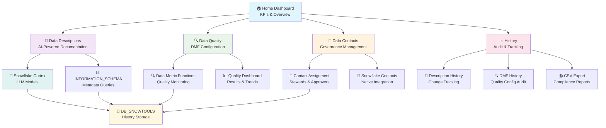

# 🏔️ Snowflake Data Quality & Documentation Platform

<div align="center">

**A comprehensive Streamlit application for enhancing data governance in Snowflake through AI-powered documentation, automated data quality monitoring, and contact management.**

[](https://streamlit.io/)
[](https://snowflake.com/)
[](https://python.org/)

*Optimized for **Streamlit in Snowflake (SiS)** with full local development support*

</div>

---

## 📺 Demo & Overview

[](https://youtu.be/OdKl4yq7ikY)

*Click to watch the full demo and feature walkthrough*

---

## 📋 Table of Contents

- [🎯 Purpose & Value Proposition](#-purpose--value-proposition)
- [🏗️ Architecture & Project Structure](#️-architecture--project-structure)
- [🔄 Application Flow](#-application-flow)
- [🌟 Core Features](#-core-features)
- [🚀 Quick Start](#-quick-start)
- [🔐 Required Permissions](#-required-permissions)
- [📖 User Guide](#-user-guide)
- [🔗 Documentation & Resources](#-documentation--resources)
- [🔧 Technical Architecture](#-technical-architecture)
- [🚨 Troubleshooting](#-troubleshooting)
- [📊 Best Practices](#-best-practices)
- [🔄 Version History](#-version-history)
- [🤝 Contributing](#-contributing)
- [📞 Support & Resources](#-support--resources)

---

## 🎯 Purpose & Value Proposition

This application transforms your Snowflake environment into a **well-documented, high-quality data platform** by providing:

- **🤖 AI-Powered Documentation**: Leverage Snowflake Cortex LLMs to automatically generate intelligent table and column descriptions
- **🔍 Data Quality Monitoring**: Comprehensive Data Metric Functions (DMF) setup and monitoring dashboard
- **👥 Data Governance**: Complete contact management system for data stewards, technical support, and access approvers
- **📊 Executive Insights**: Real-time KPIs and governance metrics for data leadership
- **📈 Audit & Compliance**: Complete historical tracking of all changes and improvements
- **🏗️ Enterprise-Ready**: Native Snowflake integration with no external dependencies

### 🎯 Target Audience

- **Data Engineers**: Streamline data quality monitoring and documentation workflows
- **Data Stewards**: Maintain comprehensive data governance and contact management
- **Analytics Teams**: Ensure high-quality, well-documented data for analysis
- **Data Leaders**: Monitor governance KPIs and compliance metrics
- **Platform Teams**: Deploy enterprise-grade data governance tools

---

## 🏗️ Architecture & Project Structure

### 📁 Modular Architecture

This application follows a **clean, modular architecture** that was refactored from a monolithic 4,000+ line file into maintainable, scalable components:

```
db-snowdq/
├── 🚀 app.py                          # Main application entry point (232 lines)
├── 📄 README.md                       # This comprehensive documentation
├── 🔧 environment.yml                 # SiS-compatible dependencies
│
├── 📱 components/                     # Reusable UI Components
│   ├── __init__.py
│   └── styles.py                      # CSS styling & theme management (285 lines)
│
├── 📄 pages/                          # Individual Page Modules
│   ├── __init__.py
│   ├── 🏠 home.py                     # Executive dashboard & KPIs
│   ├── 📝 data_descriptions.py        # AI-powered description generation
│   ├── 🔍 data_quality.py            # Data Metric Functions (DMF) configuration
│   ├── 👥 data_contacts.py           # Data governance contact management
│   └── 📈 history.py                 # Historical tracking & audit trails
│
├── 🛠️ utils/                          # Utility Modules
│   ├── __init__.py
│   ├── 🗄️ database.py                # Snowflake connections & SQL utilities
│   ├── 📊 data_fetchers.py           # Cached data retrieval functions
│   ├── 🤖 ai_utils.py                # Snowflake Cortex LLM integration
│   ├── ⚙️ setup.py                   # Database setup & session management
│   ├── 📈 kpi_utils.py               # KPI calculations & metrics
│   ├── 📝 description_helpers.py     # Description generation workflows
│   └── 🔍 dmf_utils.py               # Data Metric Functions utilities
│
└── 📜 sql/                           # Database Setup Scripts
    ├── setup_db_snowtools.sql        # Core database objects
    └── setup_app_permissions.sql     # Required permissions
```

### 🔄 Migration Benefits

| **Before (Monolithic)** | **After (Modular)** |
|--------------------------|----------------------|
| ❌ Single 4,000+ line file | ✅ Clean separation of concerns |
| ❌ Difficult to maintain | ✅ Easy to maintain and extend |
| ❌ Hard to test components | ✅ Testable individual modules |
| ❌ Poor code organization | ✅ Professional structure |
| ❌ Single developer bottleneck | ✅ Multiple developers can contribute |

---

## 🔄 Application Flow

The following diagram illustrates how the different components of the application work together:



---

## 🌟 Core Features

### 🤖 AI-Powered Data Documentation

Transform your undocumented tables and columns into comprehensive, intelligent documentation:

- **🧠 Multi-Model Support**: Choose from Snowflake Cortex models:
  - `claude-4-sonnet` (Premium reasoning)
  - `mistral-large2` (Balanced performance)
  - `llama3-70b` (Open source)
  - `snowflake-arctic` (Snowflake optimized)
  - `snowflake-llama-3.1-405b` (Latest large model)

- **🎯 Smart Context Analysis**: Analyzes table structure, column types, and sample data
- **⚡ Bulk Operations**: Generate descriptions for multiple tables and columns simultaneously
- **🔍 View Support**: Advanced DDL parsing and recreation for complex views
- **📏 Optimized Output**: 150 chars for tables, 100 chars for columns
- **👀 Real-time Preview**: Review generated descriptions before applying

### 🔍 Advanced Data Quality Monitoring

Comprehensive Data Metric Functions (DMF) setup and monitoring:

#### 📊 Supported Metrics

| **Level** | **Metric Types** | **Use Cases** |
|-----------|------------------|---------------|
| **Table** | `ROW_COUNT`, `FRESHNESS` | Monitor data volume and recency |
| **Column** | `NULL_COUNT`, `NULL_PERCENT` | Data completeness validation |
| **Column** | `DUPLICATE_COUNT`, `UNIQUE_COUNT` | Data uniqueness monitoring |
| **Column** | `ACCEPTED_VALUES` | Domain validation |
| **Column** | `AVG`, `MAX`, `MIN`, `STDDEV` | Statistical monitoring |

#### ⚙️ Configuration Features

- **🕐 Flexible Scheduling**: Periodic (minutes/hours), daily, or trigger-on-changes
- **🎛️ Bulk Configuration**: Apply metrics to all columns or configure individually
- **📜 SQL Generation**: Download ready-to-execute SQL scripts
- **📊 Results Dashboard**: Comprehensive monitoring with filters and KPIs
- **📈 Historical Analysis**: Track quality trends over time

### 👥 Data Governance & Contacts

Complete contact management system for data governance:

- **👤 Contact Types**:
  - **Data Steward**: Primary data owner and quality manager
  - **Technical Support**: Technical issues and system access
  - **Access Approver**: Data access request approvals

- **🔍 Current Assignments**: View existing contacts for any table
- **📝 Pre-populated Forms**: Automatically populate dropdowns with existing assignments
- **📜 SQL Generation**: Generate `ALTER TABLE SET CONTACT` statements
- **🔗 Native Integration**: Seamless integration with Snowflake's contact system

### 📊 Executive Dashboard & KPIs

Real-time governance metrics for data leadership:

- **📈 Real-time Metrics**:
  - Total Databases, Schemas, Tables & Views
  - Documentation coverage percentage
  - Active data quality monitors
  - Contact assignments coverage

- **🎨 Visual KPI Cards**: Modern, gradient-styled metric displays
- **🔄 Manual Refresh**: Force refresh of all KPIs from Snowflake
- **📊 Trend Analysis**: Monitor improvements over time

### 📈 Comprehensive History & Audit

Complete audit trail for compliance and governance:

- **📝 Description History**: Track all table, view, and column description changes
- **🔍 DMF Configuration History**: Monitor data quality setup changes
- **👥 Contact Assignment History**: Audit trail for governance assignments
- **📤 Export Capabilities**: Download history as CSV for compliance reporting
- **👤 User Attribution**: Track who made what changes when

---

## 🚀 Quick Start

### 🏔️ Option 1: Streamlit in Snowflake (Recommended)

1. **📤 Upload Files**: Upload `app.py`, `pages/`, `components/`, `utils/` directories, and `environment.yml` to your Snowflake stage
2. **🎯 Create App**: Create the Streamlit app in Snowflake
3. **▶️ Run**: Launch the app - it will auto-setup required database objects
4. **🔐 Grant Permissions**: Configure permissions as needed (see permissions section)

### 💻 Option 2: Local Development

```bash
# Clone the repository
git clone <repository-url>
cd db-snowdq

# Install dependencies
pip install -r requirements.txt

# Configure Snowflake connection
# Create ~/.snowflake/connections.toml with your credentials

# Run the application
streamlit run app.py
```

### ⚙️ Automatic Setup

The app automatically creates required database objects on first run:
- ✅ `DB_SNOWTOOLS` database
- ✅ `DATA_DESCRIPTION_HISTORY` table
- ✅ `DATA_QUALITY_RESULTS` table

---

## 🔐 Required Permissions

### 🏔️ Core System Access

```sql
-- Metadata and system access
GRANT IMPORTED PRIVILEGES ON DATABASE SNOWFLAKE TO ROLE your_role;
GRANT DATABASE ROLE SNOWFLAKE.OBJECT_VIEWER TO ROLE your_role;

-- Cortex LLM access for AI descriptions
GRANT DATABASE ROLE SNOWFLAKE.CORTEX_USER TO ROLE your_role;

-- Data quality monitoring
GRANT DATABASE ROLE SNOWFLAKE.DATA_METRIC_USER TO ROLE your_role;
GRANT APPLICATION ROLE SNOWFLAKE.DATA_QUALITY_MONITORING_LOOKUP TO ROLE your_role;
```

### 📊 Data Access (Customize for Your Databases)

```sql
-- Grant access to your data databases
GRANT USAGE ON DATABASE your_database TO ROLE your_role;
GRANT USAGE ON ALL SCHEMAS IN DATABASE your_database TO ROLE your_role;
GRANT SELECT ON ALL TABLES IN DATABASE your_database TO ROLE your_role;
GRANT SELECT ON ALL VIEWS IN DATABASE your_database TO ROLE your_role;

-- For description updates
GRANT MODIFY ON ALL TABLES IN DATABASE your_database TO ROLE your_role;
GRANT MODIFY ON ALL VIEWS IN DATABASE your_database TO ROLE your_role;

-- For contact management
GRANT REFERENCES ON ALL TABLES IN DATABASE your_database TO ROLE your_role;
```

### 🔍 DMF Setup (For Data Quality)

```sql
-- For setting up Data Metric Functions
GRANT OWNERSHIP ON TABLE your_database.your_schema.your_table TO ROLE your_role;
-- OR
GRANT ALL PRIVILEGES ON TABLE your_database.your_schema.your_table TO ROLE your_role;
```

---

## 📖 User Guide

### 🏠 Home Dashboard
- **📊 KPI Overview**: View real-time governance metrics
- **🚀 Quick Actions**: Navigate directly to key features
- **ℹ️ System Information**: Connection details and platform overview
- **✅ Setup Status**: Verify database objects are configured

### 📝 Data Descriptions
1. **🎯 Select Database/Schema**: Choose your target objects
2. **🔍 Filter Objects**: Show only undocumented items
3. **🤖 Choose LLM Model**: Select from available Cortex models
4. **☑️ Select Objects**: Use checkboxes to choose tables/views
5. **⚡ Generate Descriptions**: Choose table, column, or both
6. **👀 Review Results**: View generated descriptions in collapsible sections
7. **🔄 Refresh Data**: Use the refresh button to see applied changes

### 🔍 Data Quality
1. **🎯 Select Target Table**: Choose database, schema, and table
2. **⏰ Set Schedule**: Configure monitoring frequency
3. **📊 Choose DMFs**: Select table-level and column-level metrics
4. **📜 Generate SQL**: Download or apply DMF configuration
5. **📈 Monitor Results**: View quality check results and trends

### 👥 Data Contacts
1. **🎯 Select Table**: Choose your target table
2. **👀 View Current Contacts**: See existing assignments
3. **✏️ Update Assignments**: Set steward, support, and approver contacts
4. **✅ Apply Changes**: Execute generated SQL or download for later

### 📈 History
- **📝 Description History**: Track all documentation changes
- **🔍 Quality History**: Comprehensive DMF monitoring dashboard
- **📤 Export Options**: Download history data for reporting

---

## 🔗 Documentation & Resources

### 📚 Official Snowflake Documentation

- **🔍 Data Metric Functions (DMF)**: [Snowflake DMF Documentation](https://docs.snowflake.com/en/user-guide/data-quality-intro)
- **🤖 Snowflake Cortex**: [Cortex LLM Functions](https://docs.snowflake.com/en/user-guide/snowflake-cortex/llm-functions)
- **👥 Data Governance**: [Contact Management](https://docs.snowflake.com/en/sql-reference/sql/alter-table#contact-management)
- **🏔️ Streamlit in Snowflake**: [SiS Documentation](https://docs.snowflake.com/en/developer-guide/streamlit/about-streamlit)
- **🔐 Access Control**: [RBAC Guide](https://docs.snowflake.com/en/user-guide/security-access-control-overview)

### 🛠️ Technical References

- **📊 INFORMATION_SCHEMA**: [Metadata Views](https://docs.snowflake.com/en/sql-reference/info-schema)
- **🔍 Data Quality Monitoring**: [Quality Results](https://docs.snowflake.com/en/user-guide/data-quality-monitoring)
- **🎯 Best Practices**: [Data Governance](https://docs.snowflake.com/en/user-guide/data-governance-overview)

---

## 🔧 Technical Architecture

### 🏔️ SiS Compatibility Features

- **🔍 Primary Queries**: Uses `INFORMATION_SCHEMA` views for consistent results
- **🔄 Fallback System**: Automatic fallback to `SHOW` commands when needed
- **🔐 Permission Handling**: Graceful degradation with helpful error messages
- **🐛 Debug Mode**: Detailed logging for troubleshooting permission issues

### ⚡ Performance Optimizations

- **💾 Intelligent Caching**: `@st.cache_data` with TTL for optimal performance
- **📦 Batch Operations**: Efficient bulk processing for large datasets
- **🏭 Minimal Warehouse Usage**: Optimized for small warehouse compatibility
- **🧠 Memory Management**: Designed for SiS 32MB data transfer limits

### 🔒 Security & Compliance

- **🔐 Role-Based Access Control**: Follows Snowflake RBAC best practices
- **📋 Complete Audit Trail**: All changes tracked with user attribution
- **🔒 Data Privacy**: No external data transfers (runs entirely in Snowflake)
- **🛡️ Permission Isolation**: Clear separation between app and user data access

---

## 🚨 Troubleshooting

### 🏔️ Common SiS Issues

**Tables/Columns Not Displaying**
- ✅ **Fixed**: Now uses `INFORMATION_SCHEMA` queries for better compatibility
- Check app owner has proper database access permissions
- Verify `INFORMATION_SCHEMA` access is available

**Permission Errors**
- Ensure app owner role has required system privileges
- Grant `USAGE` on target databases and schemas
- Verify Cortex and DMF roles are properly assigned

**DMF Setup Failures**
- DMFs require table ownership or full privileges
- Run generated SQL with appropriate role
- Check that schedules are properly configured

### ⚡ Performance Issues

- Use smaller warehouse for better cost efficiency
- Enable caching by avoiding frequent page refreshes
- Filter to specific databases/schemas for large environments

### 🤖 Model Availability

- Check available models: `SELECT * FROM SNOWFLAKE.CORTEX.COMPLETE_AVAILABLE_MODELS()`
- Verify account region supports selected models
- Try different models if one is unavailable

---

## 📊 Best Practices

### 👥 For Data Stewards

1. **🎯 Prioritize High-Value Tables**: Start with frequently-used, business-critical tables
2. **📝 Maintain Consistency**: Use consistent description styles across your organization
3. **👀 Review AI Output**: Always review and refine AI-generated descriptions
4. **🔍 Monitor Quality**: Set up data quality monitoring on critical tables
5. **👤 Assign Ownership**: Ensure clear contact assignments for all important tables

### 🔧 For Administrators

1. **🔐 Minimal Permissions**: Grant minimal required permissions initially
2. **💰 Monitor Costs**: Track Cortex usage for cost management
3. **⏰ Smart Scheduling**: Set appropriate DMF schedules (avoid over-monitoring)
4. **📋 Compliance**: Use history tracking for compliance reporting
5. **💾 Backup Strategy**: Regular backup of `DB_SNOWTOOLS` database

### 👨‍💻 For Developers

1. **🧪 Test Environments**: Test in both SiS and local environments
2. **🐛 Use Debug Info**: Leverage debug information for troubleshooting
3. **🔄 Error Patterns**: Follow established error handling patterns
4. **⬆️ Backward Compatibility**: Maintain compatibility when extending features

---

## 🔄 Version History

### 🎉 v2.0 - Modular Architecture & Enhanced Features
- ✅ **Modular Refactor**: Clean separation from 4,000+ line monolith
- ✅ **SiS Optimization**: Full compatibility with Streamlit in Snowflake
- ✅ **INFORMATION_SCHEMA**: Primary queries for better permission handling
- ✅ **Enhanced UI**: Modern KPI dashboard and improved navigation
- ✅ **Complete DMF**: Comprehensive data quality monitoring dashboard
- ✅ **Contact Management**: Full data governance contact system
- ✅ **History Tracking**: Complete audit trail for all operations
- ✅ **Error Handling**: Graceful degradation with helpful messages

### 🚀 v1.0 - Core Features
- AI-powered description generation
- Basic DMF setup
- Multi-page navigation
- Local development support

---

## 🤝 Contributing

This application follows Snowflake best practices and is designed for easy extension:

### 🔧 Development Setup

```bash
# Clone and setup
git clone <repository-url>
cd db-snowdq
pip install -r requirements.txt

# Run locally
streamlit run app.py
```

### 📝 Adding New Features

- **🤖 Add LLM Models**: Update `AVAILABLE_MODELS` list in `utils/ai_utils.py`
- **🔍 Extend DMF Support**: Add new metric types in `utils/dmf_utils.py`
- **📄 New Pages**: Follow the pattern in `pages/` directory
- **🎨 UI Improvements**: Maintain the modern, gradient-styled design system

### 🧪 Testing Guidelines

1. Test in both SiS and local environments
2. Verify all imports and dependencies
3. Check error handling and edge cases
4. Maintain backward compatibility

---

## 📞 Support & Resources

- **📖 In-App Documentation**: Check the Documentation tab within the app
- **📜 Setup Scripts**: Review `sql/setup_*.sql` files for manual setup
- **🐛 Troubleshooting**: Use the debug information provided by the app
- **🔐 Permissions**: Verify against the detailed permissions section above

---

<div align="center">

**🎯 Built for Modern Data Teams**

*Transform your Snowflake environment into a well-documented, high-quality data platform with AI-powered automation and comprehensive governance tools!*

**🔺 Snowflake Native** • **🔒 Enterprise Secure** • **⚡ High Performance**

*Runs entirely within your Snowflake environment with no external dependencies or data transfers.*

---

**⭐ Star this repository if it helps your data governance journey!**

</div>